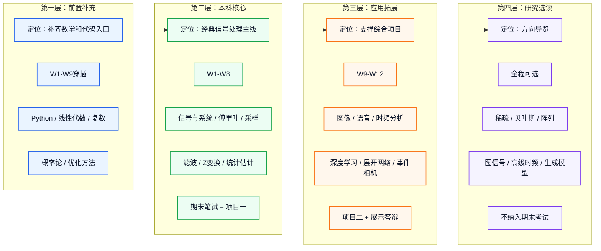

# 本科知识点体系梳理

**适用对象：** 人工智能学院本科二年级学生  
**对应课程：** 智能信号处理，13周，40理论 + 12实践  
**快速入口：** [[知识点总览]]  
**内容梳理：** [[知识点/本科知识点内容梳理]]

---

## 一、学生基础判断

参考武汉大学人工智能学院《人工智能专业培养方案》（https://ai.whu.edu.cn/info/1064/3510.htm），人工智能专业培养强调数理基础、系统能力、人工智能方法和实践能力，课程体系中包含高级语言程序设计、计算机系统导论、现代信号处理、数据结构与算法、机器学习、离散数学、计算方法与优化、深度学习与强化学习等课程。

但本课面向本科二年级学生，教学设计应采用保守假设：

| 能力 | 可以假设 | 不宜默认 |
| ------|----------|----------|
| 编程 | 学过高级语言程序设计，能写基础程序 | 熟练使用NumPy/SciPy/PyTorch处理信号数据 |
| 数学 | 学过高等数学、线性代数的主要内容 | 能熟练把矩阵、特征值、最小二乘用于信号建模 |
| 概率 | 接触过概率直觉或正在学习相关课程 | 完整掌握随机过程、平稳性、PSD和高斯估计 |
| 信号 | 可能接触过现代信号处理相关内容 | 已系统学完信号与系统、数字信号处理 |
| AI | 理解人工智能基本概念 | 已系统学完深度学习、计算机视觉、自然语言处理 |

因此，本课程知识点应遵循三条原则：

1. 先补入口，再讲主线：数学和代码基础不默认学生已经熟练。
2. 先讲直觉，再讲公式：本科阶段重点是解释公式含义和使用条件。
3. 先能做实验，再看拓展：项目二需要方向导览，但不把前沿内容纳入笔试。

---

## 二、知识点四层结构

---

## 三、前置补充层

这些知识点不作为独立长章节讲授，但必须给学生明确入口。它们的作用是降低W1-W9的理解门槛。

| 知识点 | 文件 | 建议安排 | 教学重点 |
| --------|------|----------|----------|
| Python信号处理 | [[知识点/Python信号处理速修]] | W1实验前 | 数组、采样轴、绘图、FFT、滤波、读写数据 |
| 线性代数 | [[知识点/线性代数速修]] | W1-W2穿插 | 向量、矩阵、内积、范数、最小二乘、协方差矩阵 |
| 复数与欧拉公式 | [[知识点/复数与欧拉公式速修]] | W2前 | 幅度、相位、复指数、单位圆、频率响应 |
| 概率论 | [[知识点/概率论速修]] | W3-W7前置 | 均值、方差、相关、功率谱、高斯噪声 |
| 优化方法 | [[知识点/优化方法速修]] | W7和W9前 | 损失函数、梯度下降、最小均方、正则化 |

---

## 四、本科核心层

本科核心层的目标是让学生形成完整的经典信号处理闭环：

> 信号表示 -> 频域观察 -> 采样与滤波 -> 系统分析 -> 随机建模 -> 最优估计 -> 项目表达

| 周次 | 核心知识 | 学生要达到的水平 | 关联文件 |
| ------|----------|------------------|----------|
| W1 | 信号与系统基础 | 能区分连续/离散、时域/频域、能量/功率信号；会用Python生成和观察信号 | [[知识点/经典信号处理/信号与系统基础]] |
| W2 | 傅里叶分析、FFT、STFT入门 | 能解释频谱峰值、采样频率、频率分辨率；会画幅度谱和语谱图 | [[知识点/经典信号处理/傅里叶分析]]；[[知识点/时频分析/短时傅里叶变换]] |
| W3 | 采样、混叠、功率谱 | 能解释混叠，能用Welch方法观察信号能量分布 | [[知识点/经典信号处理/采样与重建]]；[[知识点/统计信号处理/功率谱估计]] |
| W4 | 数字滤波器 | 能根据需求设计简单低通/高通/带通滤波器，并解释频率响应 | [[知识点/经典信号处理/数字滤波器设计]] |
| W5 | Z变换与系统函数 | 能把Z变换看成离散系统分析工具，理解零极点和稳定性的关系 | [[知识点/经典信号处理/Z变换]] |
| W6 | 图像与语音基础 | 能把图像和语音都看作可分析的信号，理解二维频谱、语谱图和MFCC | [[知识点/图像信号处理/图像去噪]]；[[知识点/语音信号处理/语音信号基础]] |
| W7 | 随机信号与最优估计 | 能理解噪声、相关、PSD；能说明维纳、卡尔曼、LMS分别解决什么问题 | [[知识点/统计信号处理/随机信号基础]]；[[知识点/统计信号处理/维纳滤波]]；[[知识点/统计信号处理/卡尔曼滤波]]；[[知识点/统计信号处理/自适应滤波]] |
| W8 | 经典方法整合 | 能围绕真实数据写清楚问题、方法、结果和误差来源 | [[知识点/经典信号处理/经典信号处理]] |

---

## 五、应用拓展层

应用拓展层服务项目二，不宜在课堂上展开复杂理论。课堂组织建议按“任务 -> 数据 -> baseline -> 模型 -> 指标 -> 失败原因”展开。

| 周次 | 知识点 | 本科适配处理 | 关联文件 |
| ------|--------|--------------|----------|
| W9 | 深度学习基础 | 讲网络、损失函数、训练/验证流程，不追求反向传播完整推导 | [[知识点/深度学习/深度学习基础]] |
| W10 | 图像AI处理 | 从图像去噪、超分辨率、重建任务进入，重点看输入输出和评价指标 | [[知识点/图像信号处理/图像超分辨率]]；[[知识点/图像信号处理/图像重建]]；[[知识点/图像信号处理/计算成像]] |
| W10 | 语音AI处理 | 从语谱图、MFCC、语音增强和分离进入，重点看baseline和指标 | [[知识点/语音信号处理/语音增强]]；[[知识点/语音信号处理/语音分离]]；[[知识点/语音信号处理/声源定位]] |
| W10-W11 | 时频拓展 | STFT是必会，小波和EMD作为非平稳信号的可视化与特征工具 | [[知识点/时频分析/小波变换]]；[[知识点/时频分析/经验模态分解]] |
| W11 | 展开网络 | 用“把经典迭代算法展开成网络层”解释，不要求推导LISTA/ADMM-Net | [[知识点/深度学习/展开网络]] |
| W11 | 生成模型 | 只讲VAE/GAN/扩散模型能做什么、什么时候不该用 | [[知识点/深度学习/生成模型]] |
| W11 | 事件驱动视觉 | 讲事件数据格式、事件帧/体素网格、典型任务 | [[知识点/事件驱动/事件相机基础]]；[[知识点/事件驱动/事件流处理算法]]；[[知识点/事件驱动/事件驱动视觉应用]] |

---

## 六、研究选读层

现有知识库中有一些内容适合保留，但要明确降低本科要求。

| 知识点                                                       | 为什么不作为大二主线                  | 本课程处理方式                 |
| --------------------------------------------------------- | --------------------------- | ----------------------- |
| [[知识点/时频分析/时频分布]]                                         | Wigner-Ville和Cohen类需要更强数学基础 | 只讲“比STFT更精细但有交叉项”的直觉    |
| [[知识点/稀疏信号处理/压缩感知]]                                       | RIP、L1优化和重构理论难度偏高           | 项目二中可作为计算成像背景           |
| [[知识点/优化方法/凸优化基础]]；[[知识点/优化方法/近端算子]]；[[知识点/优化方法/ADMM算法]]  | 完整凸优化一般应在后续课程系统学习           | 本课只保留[[知识点/优化方法速修]]作为入口 |
| [[知识点/贝叶斯方法/贝叶斯推断]]；[[知识点/贝叶斯方法/MCMC]]；[[知识点/贝叶斯方法/变分推断]] | 需要概率统计和机器学习基础               | 只在MMSE/MAP直觉中点到         |
| [[知识点/阵列信号处理/阵列信号模型]]；[[知识点/阵列信号处理/DOA估计]]                | 涉及空间采样、矩阵分解和阵列几何            | 只作为声源定位拓展               |
| [[知识点/图信号处理/图论基础]]；[[知识点/图信号处理/图傅里叶变换]]                   | 图谱理论和图傅里叶变换较抽象              | 作为图神经网络后续学习入口           |
| [[知识点/事件驱动/脉冲神经网络]]                                       | 需要神经动力学和训练方法背景              | 只讲事件驱动计算直觉              |

---

## 七、知识点编写规范

后续每个知识点文件建议统一加入以下四个标签，避免学生误判学习深度：

| 标签 | 含义 |
| ------|------|
| 必须掌握 | 期末笔试、实验或项目一会直接用到 |
| 会用即可 | 需要能调用工具、解释结果，但不要求完整推导 |
| 了解即可 | 课堂导览或项目二背景，不作为考试重点 |
| 研究选读 | 保留给学有余力或后续课程，不纳入本课考核 |

每个知识点文件建议回答三个问题：

1. 这个知识点解决什么问题？
2. 本课程要求学到什么深度？
3. 它和实验/项目的关系是什么？

---

## 八、对13周教学的约束

| 周次 | 课堂知识密度控制 |
| ------|------------------|
| W1-W5 | 以经典基础为主，公式要讲含义和可视化，不追求连续时间理论完整性 |
| W6-W7 | 图像、语音、统计方法只讲能支撑实验和项目一的部分 |
| W8 | 用项目一回收经典方法，避免继续增加新理论 |
| W9-W11 | AI方法按“任务、数据、模型、指标、限制”组织，不做研究生专题 |
| W12-W13 | 服务项目二结果解释和期末复习，不再增加重理论知识点 |

---

## 九、版本说明

本文件是对现有知识库的本科化重排。具体到每个知识点应该如何讲解、如何兼顾通俗性和学术严谨性，见[[知识点/本科知识点内容梳理]]。所有表格内链接均采用不带别名的内部链接格式，避免Markdown表格把链接中的竖线识别为分隔符。

*本科知识点体系梳理 v1.3 · 2026-06-02 · 增加内容梳理入口*